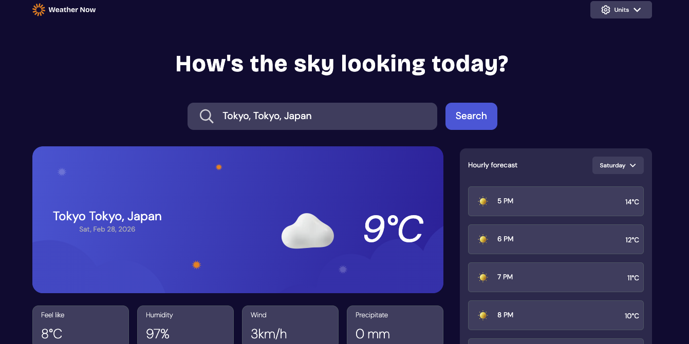

# Frontend Mentor – Weather App Solution

This repo contains my solution to the [Weather app challenge on Frontend Mentor](https://www.frontendmentor.io/challenges/weather-app-K1FhddVm49).  
The goal of the challenge is building a responsive, interactive weather application using real‑world APIs and modern frontend tooling.

---

## 📑 Table of contents

- [Overview](#overview)  
  - [The challenge](#the-challenge)  
  - [Screenshot](#screenshot)  
  - [Links](#links)  
- [My process](#my-process)  
  - [Built with](#built-with)  
  - [What I learned](#what-i-learned)  
  - [Continued development](#continued-development)  
  - [Useful resources](#useful-resources)  
- [Author](#author)  
- [Acknowledgments](#acknowledgments)

---

## Overview

### The challenge

Users should be able to:

- Search for weather by typing a location (autosuggestions provided)
- View current conditions (temperature, description, icon, location, date)
- Inspect “feels‑like” temp, humidity, wind speed, precipitation
- Browse a 7‑day forecast with daily high/low and icons
- See an hourly forecast for the selected day
- Toggle days in the hourly view via a day selector
- Switch between Metric and Imperial units (C/°F, km/h ↔ mph, mm ↔ in)
- Have responsive layouts for mobile/tablet/desktop
- Experience hover/focus states on interactive elements
- Handle loading and offline/error states gracefully

### Screenshot



### Links

- **Solution URL:** <https://github.com/Melodyysol/weather-app>  
- **Live site URL:** <https://melodyysol.github.io/weather-app/>

---

## My process

### Built with

- Semantic **HTML5**
- **Tailwind CSS** (compiled to `dist/output.css`)
- Vanilla **JavaScript** (ES modules)
- [Open‑Meteo](https://open-meteo.com/) weather & geocoding APIs
- Mobile‑first, responsive design
- CSS Grid & Flexbox
- Custom loading animations via CSS
- No frameworks—pure client‑side code

### What I learned

- Managing state in a small vanilla‑JS app: units, loading, suggestions
- Dynamic DOM rendering with template literals
- Building a custom dropdown/checkbox control with exclusive options
- Handling async API calls and custom events (`weather:loaded`)
- Accessibility considerations for clickable elements and focus styles
- Using Tailwind’s utility classes to quickly compose layouts

> *Code snippets worth highlighting:*

```js
// toggle imperial/metric states and refresh data
if (isCurrentlyImperial) {
  selectedUnits.temperature = 'celsius';
  …
} else {
  selectedUnits.temperature = 'fahrenheit';
  …
}
getWeatherByCityName(searchInput.value);
```

### Continued development

- Add tests (Jest/Playwright) for UI behavior
- Cache last successful result in `localStorage`/Service Worker
- Re‑enable geolocation on load with permission handling
- Improve accessibility (aria‑roles, keyboard navigation)
- Animate transitions between unit conversions

### Useful resources

- [Open‑Meteo API docs](https://open-meteo.com/en/docs) – great lightweight weather API  
- [Tailwind CSS documentation](https://tailwindcss.com/docs) – handy for rapid layout  
- [Frontend Mentor challenge page](https://www.frontendmentor.io/challenges) – design & spec reference

---

## Author

- Frontend Mentor – [@Melodyysol](https://frontendmentor.io/profile/melodyysol)  
- Twitter – [@Melody_Shiller](https://twitter.com/Melody_Shiller)

---

## Acknowledgments

Thanks to the Frontend Mentor community for inspiration and feedback—especially the challenge’s solution gallery.  
Shout‑out to anyone who reviewed my code or suggested UX improvements.
